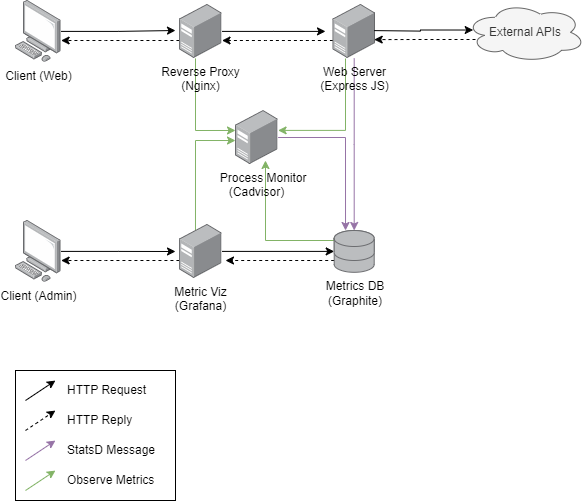

# Trabajo Práctico 1 - Arquitectura de Software

## Integrantes

- Agustin Leguizamon
- Franco Scaccheri
- Nicolas Zulaica
- Elian Foppiano

## Enunciado

[Link al enunciado](./enunciado.md)

## Sistema

El sistema consiste en una api web que consume y responde en base a otras apis externas.
Ademas, se provee un panel de métricas para poder evaluar el funcionamiento del sistema.

Siendo el objetivo principal del proyecto evaluar el efecto de ciertas tacticas sobre los atributos de calidad.

### Tácticas

Se implementan diversas tácticas, cada una en una branch `tactics/` independiente.

- Replicación
- Limitar tasa
- Caché

### Arquitectura



## Ejecución

### Levantar el sistema

```bash
make up
```

### Detener containers

```bash
make down
```

### Ping

```bash
make ping
```

### Logs

```bash
make logs-all
```

### Pruebas

```bash
cd perf
npm run <test> # test = {metar_load, space_news_load, ...} see package.json for more
```
